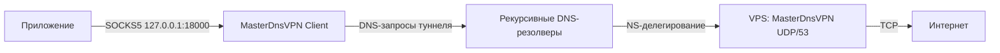

# MasterDnsVPN VPS Setup

Безопасный установщик [MasterDnsVPN](https://github.com/masterking32/MasterDnsVPN) на VPS через Docker Compose. Репозиторий подготавливает сервер, постоянные данные и готовую пару клиентских файлов, а также предоставляет команды обновления, диагностики, ротации ключа и удаления.

> [!IMPORTANT]
> MasterDnsVPN передаёт TCP-трафик внутри DNS-запросов и ответов. На клиенте он поднимает локальный SOCKS5-прокси, а не системный VPN-интерфейс. Скорость и стабильность зависят от рекурсивных DNS-резолверов, делегирования домена, MTU и ограничений сети.

## Что делает установщик

- устанавливает Docker Engine и Compose plugin из официального apt-репозитория Docker, если их ещё нет;
- поддерживает существующий Docker на других Linux-дистрибутивах;
- создаёт управляемое развёртывание в `/opt/masterdns-vps-setup`;
- запускает официальный образ `ghcr.io/masterking32/masterdnsvpn`;
- сохраняет серверную конфигурацию и ключ вне контейнера;
- генерирует `client_config.toml` и `client_resolvers.txt`;
- использует ChaCha20 по умолчанию вместо небезопасного XOR из upstream-примера;
- ограничивает возможности контейнера и включает ротацию Docker-логов;
- открывает TCP/UDP 53 только в активном UFW или firewalld;
- аккуратно освобождает порт 53 от локального stub listener `systemd-resolved`, не завершая посторонние процессы;
- проверяет NS-делегирование и совпадение A-записи nameserver с публичным IPv4 VPS;
- при удалении сохраняет ключ и конфигурацию, если явно не передан `--purge`.

Скрипт не очищает существующие правила firewall, не удаляет Docker, не завершает процессы на порту 53 и не изменяет SSH.

## Схема



Для `v.example.com` публичная DNS-зона должна делегировать этот поддомен nameserver-хосту, указывающему на VPS:

```text
ns.example.com.  A   203.0.113.10
v.example.com.   NS  ns.example.com.
```

## Требования

### VPS

- публичный IPv4;
- Linux с root-доступом;
- свободный публичный порт 53 UDP и TCP;
- для автоматической установки Docker: Debian или Ubuntu;
- для других дистрибутивов: заранее установленный Docker Engine с командой `docker compose`;
- поддерживаемая официальным образом архитектура:
  - `linux/amd64`;
  - `linux/arm64/v8`;
  - `linux/arm/v5`;
  - `linux/arm/v7`;
  - `linux/mips64le`.

Upstream рекомендует современные Ubuntu 22.04+ или Debian 12+ для Linux-бинарников. Сам Docker-образ использует Debian Bookworm.

### Домен

Нужен домен, в котором можно создавать `A` и `NS` записи. Используйте короткие имена: чем короче туннельный домен, тем больше полезных данных помещается в DNS-пакет.

Пример для `example.com`:

| Тип | Имя | Значение |
| --- | --- | --- |
| `A` | `ns` | публичный IPv4 VPS |
| `NS` | `v` | `ns.example.com` |

Если DNS обслуживает Cloudflare, запись `A` для `ns` должна быть в режиме **DNS only** — серое облако. Запись `NS` не проксируется.

Не публикуйте `AAAA` для `ns.example.com`, если MasterDnsVPN недоступен по IPv6: часть резолверов может предпочесть неработающий IPv6-маршрут.

Проверка после распространения DNS:

```bash
dig +short NS v.example.com @1.1.1.1
dig +short A ns.example.com @1.1.1.1
```

Первая команда должна вернуть `ns.example.com.`, вторая — публичный IPv4 VPS.

## Быстрый старт

```bash
git clone https://github.com/XXcipherX/masterdns-vps-setup.git
cd masterdns-vps-setup
sudo ./vps-setup.sh install --domain v.example.com
```

Если Docker отсутствует на Debian/Ubuntu, установщик добавит [официальный apt-репозиторий Docker](https://docs.docker.com/engine/install/) и установит Engine вместе с [Compose plugin](https://docs.docker.com/compose/install/linux/).

Установщик намеренно не удаляет конфликтующие пакеты `docker.io`, `podman-docker`, `containerd` или `runc`. Если найдено неполное/смешанное Docker-окружение, он остановится и предложит исправить его вручную.

Без аргумента `--domain` скрипт спросит домен интерактивно:

```bash
sudo ./vps-setup.sh install
```

Для полностью неинтерактивного запуска:

```bash
sudo ./vps-setup.sh install \
  --domain v.example.com \
  --yes
```

`--yes` разрешает только подтверждённую обработку локального `systemd-resolved`. Посторонняя служба на порту 53 всё равно остановит установку.

## Результат установки

По умолчанию файлы находятся здесь:

```text
/opt/masterdns-vps-setup/
├── .env
├── compose.yaml
├── data/
│   ├── encrypt_key.txt
│   └── server_config.toml
├── client/
│   ├── client_config.toml
│   └── client_resolvers.txt
├── state/
├── templates/
└── vps-setup.sh
```

Каталоги с конфигурацией имеют режим `0700`, ключ и клиентская конфигурация — `0600`.

## Настройка клиента

1. Скачайте клиент для своей ОС из [официального релиза MasterDnsVPN](https://github.com/masterking32/MasterDnsVPN/releases/latest).
2. Распакуйте архив.
3. Скопируйте с VPS два файла:
   - `/opt/masterdns-vps-setup/client/client_config.toml`;
   - `/opt/masterdns-vps-setup/client/client_resolvers.txt`.
4. Положите их рядом с исполняемым файлом клиента.
5. Запустите клиент.
6. Настройте приложение или браузер на SOCKS5 `127.0.0.1:18000`.

Пример безопасного копирования файлов из root-каталога в домашний каталог текущего SSH-пользователя:

```bash
sudo install -m 600 \
  /opt/masterdns-vps-setup/client/client_config.toml \
  "$HOME/client_config.toml"

sudo install -m 600 \
  /opt/masterdns-vps-setup/client/client_resolvers.txt \
  "$HOME/client_resolvers.txt"

sudo chown "$USER:$USER" \
  "$HOME/client_config.toml" \
  "$HOME/client_resolvers.txt"
```

После этого их можно забрать обычным `scp`.

> [!WARNING]
> `client_config.toml` содержит общий ключ туннеля. Не публикуйте файл в issue, логах, чатах или Git.

### Резолверы

В стартовом `client_resolvers.txt` указаны несколько публичных резолверов. Это не универсальный список: в конкретной сети они могут блокироваться, ограничивать частоту запросов или иметь слишком маленький MTU.

Клиент принимает:

```text
8.8.8.8
1.1.1.1:53
192.0.2.0/30
192.0.2.0/30:5353
[2001:4860:4860::8888]:53
```

Файл можно менять на клиенте без изменений сервера. В сложной сети используйте функцию поиска/сканирования резолверов из upstream-документации и оставляйте только прошедшие MTU-проверку адреса.

## Управление

Команды можно выполнять как из клона репозитория, так и установленной копией:

```bash
sudo /opt/masterdns-vps-setup/vps-setup.sh status
sudo /opt/masterdns-vps-setup/vps-setup.sh logs
sudo /opt/masterdns-vps-setup/vps-setup.sh logs --follow
sudo /opt/masterdns-vps-setup/vps-setup.sh doctor
sudo /opt/masterdns-vps-setup/vps-setup.sh check-dns
sudo /opt/masterdns-vps-setup/vps-setup.sh restart
sudo /opt/masterdns-vps-setup/vps-setup.sh stop
sudo /opt/masterdns-vps-setup/vps-setup.sh start
```

### Изменение серверной конфигурации

```bash
sudo EDITOR=nano /opt/masterdns-vps-setup/vps-setup.sh config
```

Скрипт откроет `server_config.toml`, применит изменения, перезапустит контейнер и пересоздаст клиентскую конфигурацию. Если меняются `DOMAIN` или `DATA_ENCRYPTION_METHOD`, замените клиентские файлы на всех устройствах.

Установщик принимает один домен при первичной установке. Если вручную указать несколько доменов в серверном массиве `DOMAIN`, команда `config`/`client-config` перенесёт весь массив в клиентский `DOMAINS`; все домены должны вести на тот же сервер, как требует upstream.

Расширенный перечень параметров находится в [официальном server_config.toml.simple](https://github.com/masterking32/MasterDnsVPN/blob/main/server_config.toml.simple).

### Пересоздание клиентских файлов

```bash
sudo /opt/masterdns-vps-setup/vps-setup.sh client-config
```

Команда берёт домен и метод шифрования из активного серверного конфига, а ключ — из `encrypt_key.txt`. Пользовательский список резолверов не перезаписывается.

### Ротация ключа

```bash
sudo /opt/masterdns-vps-setup/vps-setup.sh rotate-key
```

Контейнер будет остановлен, новый ключ сгенерирован криптографически стойким генератором, после чего сервер запустится с обновлённой клиентской конфигурацией. Старый ключ сохраняется в `state/` для ручного отката. Все старые клиентские файлы перестанут подключаться.

## Обновление и фиксация версии

Обычное обновление:

```bash
sudo /opt/masterdns-vps-setup/vps-setup.sh update
```

По умолчанию используется `ghcr.io/masterking32/masterdnsvpn:latest`. Для воспроизводимого развёртывания закрепите тег. Например, последним релизом на момент проверки репозитория был `v2026.06.13.234407-7de2476`:

```bash
sudo /opt/masterdns-vps-setup/vps-setup.sh update \
  --image ghcr.io/masterking32/masterdnsvpn:v2026.06.13.234407-7de2476
```

Вернуться на отслеживание `latest`:

```bash
sudo /opt/masterdns-vps-setup/vps-setup.sh update \
  --image ghcr.io/masterking32/masterdnsvpn:latest
```

Обновление сохраняет `data/server_config.toml`, `data/encrypt_key.txt` и список клиентских резолверов. Если upstream повысил версию конфигурации, сравните текущий файл с новым `server_config.toml.simple` перед обновлением.

## Шифрование

Новая установка использует `ChaCha20`:

```bash
sudo ./vps-setup.sh install \
  --domain v.example.com \
  --encryption chacha20
```

Доступные значения:

| Аргумент | ID MasterDnsVPN | Комментарий |
| --- | ---: | --- |
| `none` | 0 | без шифрования, не рекомендуется |
| `xor` | 1 | лёгкое сокрытие, криптографически небезопасно |
| `chacha20` | 2 | значение установщика по умолчанию |
| `aes-128-gcm` | 3 | AEAD |
| `aes-192-gcm` | 4 | AEAD |
| `aes-256-gcm` | 5 | AEAD |

Метод и ключ должны точно совпадать на сервере и клиенте.

## Порт 53 и systemd-resolved

Docker не сможет опубликовать порт 53, если его уже занимает DNS-служба. Установщик показывает владельца порта и:

- если все найденные слушатели принадлежат активному `systemd-resolved`, предлагает отключить только `DNSStubListener`;
- при необходимости переводит `/etc/resolv.conf` со stub-файла на `/run/systemd/resolve/resolv.conf`, чтобы сам VPS не потерял DNS;
- сохраняет предыдущее состояние и восстанавливает его при ошибке установки или удалении;
- отказывается завершать `dnsmasq`, BIND, Unbound, Pi-hole и любые другие процессы.

Запретить автоматическое предложение:

```bash
sudo ./vps-setup.sh install \
  --domain v.example.com \
  --no-resolved-fix
```

Диагностика вручную:

```bash
sudo ss -lntup 'sport = :53'
```

Если порт занимает другая служба, решите конфликт вручную и повторите установку.

## Firewall

Установщик добавляет `53/udp` и `53/tcp` в активный UFW или firewalld и запоминает только созданные им правила. При удалении снимаются только эти правила.

Отключить изменение host firewall:

```bash
sudo ./vps-setup.sh install \
  --domain v.example.com \
  --skip-firewall
```

Даже после локальной настройки нужно разрешить TCP/UDP 53 в панели облачного провайдера: AWS Security Group, Oracle Cloud Security List/NSG, Hetzner Firewall и аналогах.

## Безопасность

- контейнер использует официальный upstream-образ;
- из capabilities оставлен только `NET_BIND_SERVICE`;
- включён `no-new-privileges`;
- Docker-логи ротируются: 5 файлов по 10 MiB;
- ключ и клиентская конфигурация доступны только root;
- SOCKS5 клиента привязан к `127.0.0.1`, поэтому не выставляется в LAN/интернет;
- серверный `LOG_LEVEL` установлен в `WARN`.

Последний пункт важен: текущий upstream-сервер при уровне `INFO` записывает активный ключ в стартовый лог. Включайте `INFO` или `DEBUG` только на время диагностики и относитесь к сохранённым логам как к секрету.

Контейнер upstream запускается от root: его entrypoint копирует конфигурацию и ключ между `/data` и `/opt/masterdnsvpn`, а сервер слушает привилегированный порт 53. Установщик сокращает capabilities, но не меняет пользователя внутри стороннего образа.

MasterDnsVPN использует общий ключ, а не отдельные серверные аккаунты. Любое устройство с копией клиентской конфигурации получает доступ к туннелю. Для отзыва доступа нужно ротировать ключ на сервере и заменить конфигурацию только на разрешённых клиентах.

## Резервное копирование

Остановите сервис и создайте архив:

```bash
sudo /opt/masterdns-vps-setup/vps-setup.sh stop
sudo tar -C /opt -czf /root/masterdns-backup.tar.gz masterdns-vps-setup
sudo /opt/masterdns-vps-setup/vps-setup.sh start
```

Архив содержит ключ. Храните его как секрет.

Для восстановления распакуйте каталог обратно в `/opt`, установите права и запустите `install`:

```bash
sudo tar -C /opt -xzf /root/masterdns-backup.tar.gz
sudo chmod 700 /opt/masterdns-vps-setup
sudo /opt/masterdns-vps-setup/vps-setup.sh install
```

## Удаление

Остановить и удалить контейнер, но сохранить конфигурацию и ключ:

```bash
sudo /opt/masterdns-vps-setup/vps-setup.sh uninstall
```

Полностью удалить управляемый каталог:

```bash
sudo /opt/masterdns-vps-setup/vps-setup.sh uninstall --purge
```

`--purge` необратимо удаляет ключ, серверную и клиентскую конфигурации. Скрипт проверяет специальный marker-файл и не удаляет широкие системные каталоги. Docker и кэш образов не удаляются.

## Диагностика

```bash
sudo /opt/masterdns-vps-setup/vps-setup.sh doctor
```

Проверяются:

- валидность Compose;
- состояние контейнера;
- наличие слушателя на порту 53;
- соответствие длины ключа выбранному алгоритму;
- права `0600` на ключ;
- NS-делегирование;
- совпадение A-записи nameserver с публичным IPv4 VPS.

Для последней проверки скрипт запрашивает текущий публичный IPv4 у `https://api.ipify.org`. Используйте `--skip-dns-check`, если такая внешняя проверка нежелательна.

### Контейнер не запускается

```bash
sudo /opt/masterdns-vps-setup/vps-setup.sh status
sudo /opt/masterdns-vps-setup/vps-setup.sh logs
sudo ss -lntup 'sport = :53'
```

Частые причины:

- порт 53 занят локальным DNS;
- образ не поддерживает архитектуру VPS;
- Docker daemon не запущен;
- повреждён TOML;
- длина существующего ключа не соответствует изменённому методу шифрования.

### Клиент не находит рабочие соединения

Проверяйте по порядку:

1. `DOMAINS` совпадает с серверным `DOMAIN`;
2. `DATA_ENCRYPTION_METHOD` и `ENCRYPTION_KEY` совпадают;
3. `dig +short NS v.example.com @1.1.1.1` возвращает нужный nameserver;
4. nameserver A-запись указывает на VPS и не проксируется CDN;
5. в firewall провайдера открыт UDP/53;
6. клиентские резолверы доступны из текущей сети;
7. хотя бы одна пара resolver/domain проходит MTU-тест.

Короткий домен обычно повышает максимально возможный upload MTU. Если EDNS0 режется, уменьшение `MAX_DOWNLOAD_MTU` может дать более стабильный результат.

### `dig google.com @IP_VPS` возвращает пустой ответ

Это не проверка проксирования MasterDnsVPN. Сервер не является обычным публичным рекурсивным DNS: он обрабатывает запросы специального туннельного протокола под делегированным доменом. Обычный запрос может получить пустой ответ или отказ в зависимости от версии upstream.

Проверяйте:

- делегирование командами `dig NS` и `dig A`;
- готовность контейнера через `doctor`;
- сам туннель — официальным клиентом и его MTU/session-логами.

### Oracle Cloud

Кроме Security List/NSG проверьте локальный firewall Ubuntu и `systemd-resolved`. В OCI нередко одновременно открывают порт в облачной панели, но оставляют локальный stub listener на 53. Установщик умеет обработать только стандартный `systemd-resolved`; сторонние DNS-службы нужно остановить или перенастроить вручную.

## Локальная проверка без Docker

Скрипт умеет только отрисовать развёртывание:

```bash
./vps-setup.sh install \
  --dry-run \
  --domain v.example.com \
  --install-dir /tmp/masterdns-dry-run
```

При `--dry-run` не проверяется root, не устанавливаются пакеты, не меняются firewall/`systemd-resolved`, не загружается образ и не запускается контейнер.

Тесты:

```bash
bash -n vps-setup.sh tests/smoke.sh
bash tests/smoke.sh
```

При наличии ShellCheck:

```bash
shellcheck -x --severity=warning vps-setup.sh tests/smoke.sh
```

## Совместимость с upstream

Репозиторий спроектирован по коду и документации MasterDnsVPN на commit [`bc69a58`](https://github.com/masterking32/MasterDnsVPN/commit/bc69a58be67b8ff304908fdb9081a53f4a666be6) от 19 июля 2026 года. На момент проверки последний опубликованный релиз и Docker tag — [`v2026.06.13.234407-7de2476`](https://github.com/masterking32/MasterDnsVPN/releases/tag/v2026.06.13.234407-7de2476), формат серверного конфига — `12`.

Используются подтверждённые upstream-контракты:

- образ `ghcr.io/masterking32/masterdnsvpn`;
- volume `/data`;
- файлы `/data/server_config.toml` и `/data/encrypt_key.txt`;
- переменная первого запуска `DOMAIN`;
- порты `53/udp` и `53/tcp`;
- клиентский SOCKS5 `127.0.0.1:18000`;
- одинаковые домен, encryption method и key на обеих сторонах.

Этот репозиторий не содержит и не пересобирает бинарники MasterDnsVPN.

## Ограничения и отказ от ответственности

MasterDnsVPN — исследовательский проект. DNS-туннель может нарушать правила сети или хостинг-провайдера, обнаруживаться средствами сетевого мониторинга, ограничиваться rate limit и работать заметно медленнее обычного VPN.

Используйте проект только в законных целях, в сетях и на серверах, где у вас есть разрешение. Авторы установщика и upstream-проекта не дают гарантий пригодности и не отвечают за блокировки, потерю доступа, данных или другие последствия.

## Участие в разработке

См. [CONTRIBUTING.md](CONTRIBUTING.md). Сообщения об уязвимостях — в [SECURITY.md](SECURITY.md).

## Лицензия

Код этого репозитория распространяется по лицензии [MIT](LICENSE). MasterDnsVPN является отдельным проектом Amin Mahmoudi (`masterking32`) и распространяется на условиях собственной [MIT License](https://github.com/masterking32/MasterDnsVPN/blob/main/LICENSE). Дополнительная информация — в [NOTICE](NOTICE).
